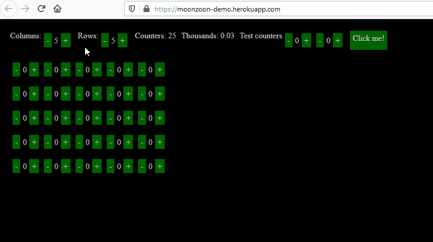
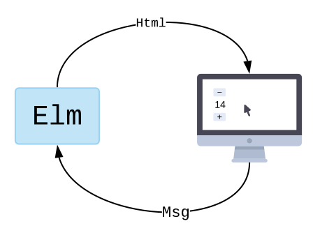

# MoonZoon Dev News (2): Live demo, Zoon, Examples, Architectures

The Zoon dev marathon is over. And it does something! And it does something on Heroku!

[](https://raw.githubusercontent.com/MoonZoon/MoonZoon/main/docs/images/demo.gif)

You can try it by yourself: [Live demo](https://moonzoon-demo.herokuapp.com/)

---

<p align="center">
  <strong>Welcome to the MoonZoon Dev News!</strong>
</p>

<p align="center">
  
</p>


[MoonZoon](https://moonzoon.rs) is a [Rust](https://www.rust-lang.org/) full-stack framework. If you want to read about new MZ features, architecture and interesting problems & solutions - Dev News is the right place.

---

# News

There are again two big news. I've written the Zoon core ([GitHub PR](https://github.com/MoonZoon/MoonZoon/pull/5)) and created a new GitHub [repo with the demo](https://github.com/MoonZoon/demo).

However the main goal for this iteration was to write working examples:
- [Counter](https://github.com/MoonZoon/MoonZoon/tree/main/examples/counter)
- [Counters](https://github.com/MoonZoon/MoonZoon/tree/main/examples/counters)
- [Counters without macros](https://github.com/MoonZoon/MoonZoon/tree/main/examples/counters_without_macros)

You can follow the updated [Development.md](https://github.com/MoonZoon/MoonZoon/blob/main/docs/development.md) to run those examples on your local machine.

---

Other significant changes:
- The dev server runs on HTTP by default and the Moon server(s) are configurable through environment variables. See updated [Cli.md](https://github.com/MoonZoon/MoonZoon/blob/main/docs/cli.md).
- The Zoon API has been changed a bit - see updated [Frontend.md](https://github.com/MoonZoon/MoonZoon/blob/main/docs/frontend.md). 
- I've written a super simple Heroku [buildpack](https://github.com/MoonZoon/heroku-buildpack-moonzoon). Feel free to improve it (e.g. to use cache).

---

And I would like to thank:
- [gilescope](https://github.com/gilescope) for MoonZoon improvements in PRs [3](https://github.com/MoonZoon/MoonZoon/pull/3) and [4](https://github.com/MoonZoon/MoonZoon/pull/4). 
- [sagiegurari](https://github.com/sagiegurari) for very quick integration of my PRs into his awesome [cargo-make](https://github.com/sagiegurari/cargo-make). This task runner is very useful for both MoonZoon and Seed.

---

# Frontend framework architectures

The basic purpose of all frontend frameworks is to present some useful data to users and handle user reactions to those presented data.

---

## The Elm architecture

The Elm architecture (TEA) is the most accurate representation of that purpose definition. 

The official [Elm guide](https://guide.elm-lang.org/architecture/) explains TEA this way:

--



_Credits: elm-lang.org_

The Elm program produces HTML to show on screen, and then the computer sends back messages of what is going on. "They clicked a button!"

What happens within the Elm program though? It always breaks into three parts:

   - Model — the state of your application
   - View — a way to turn your state into HTML
   - Update — a way to update your state based on messages

These three concepts are the core of The Elm Architecture.

--

However every architecture shows its trade-offs when our apps becomes larger.

In the case of TEA, you'll soon find out your code consists of 5 big isolated trees - `Model`, `init` (to setup `Model`), `Msg`, `update` and `view`. But many parts of your application need to use only a part of each tree and almost nothing more. 

A typical example is a page. A page with a contact form and a page with a login form use different data and business logic and render different elements. However both pages probably want to know what user is logged in.

@TODO picture 5 trees |, two pages ---- + context / user ; PageInit, PageMsg, PageModel, PageUpdate, PageView

As the result, developers cut the trees into pieces and group those pieces together with pieces belonging to other trees. 

And that's how components are born in TEA. 

However the pieces are grouped mostly logically, not by a language construct, so developers tend to start looking for a stronger grouping mechanism due to the fear of broken components. At the end, they replace flexibility with some cumbersome abstractions. And then they add an extra abstraction layer for shared data (e.g. the logged user in our example)...


_Credits: Game Layers of Fear. Downloaded from wallpapercave.com._

With those groups (aka components) comes another problem - inter-component communication. There are some [patterns](https://rchavesferna.medium.com/child-parent-communication-in-elm-outmsg-vs-translator-vs-nomap-patterns-f51b2a25ecb1) for parent-child communication but for other relations there are basically none. Elm has [subscriptions](https://elmprogramming.com/subscriptions.html) to alleviate the problem but you can't create custom subscriptions. Seed has a similar concept `subscribe/notify` that helps a lot with the app architecture from my experience. 


There are also two data features that are difficult to take into account in TEA:
- A) You can't use most "raw" data directly for rendering.
   - When you need to round real numbers to show nice values in your e-shop orders. 
   - There are also much more complex transformations - for instance when you need to interpolate values for your (Javascript) charts. (_Note_: We often escape from TEA and use [custom elements](https://guide.elm-lang.org/interop/custom_elements.html) for such cases.)

- B) Not all data are equally important for your business and for all app parts.
   - User's mail will be used by many pages and you really don't want to accidentally modify it or use its old value.
   - The shadow size of an animated button will be interesting probably only for the related button.

In TEA we have only one `Model`. It means our business data will be mixed with precomputed and temporary data. And relations between "raw" and "derived" data won't be obvious on the first look.


_Credits: Photo by [Joanna Kosinska](https://unsplash.com/@joannakosinska?utm_source=unsplash&utm_medium=referral&utm_content=creditCopyText) on [Unsplash](https://unsplash.com/s/photos/tea-book?utm_source=unsplash&utm_medium=referral&utm_content=creditCopyText)_

I was mostly talking TEA negatives in this article, but I think TEA is the paragon of "the beauty of simplicity" and it allows to write very reliable apps with readable code. However there are some trade-offs: It makes writing reusable app parts difficult and it lacks some mechanisms for data management and communication within larger apps. Another problem is difficult optimization of apps based on TEA in many programming languages.

---

## Component-based architecture

Imagine an apple tree. Where tree is a DOM tree. And where apples have life-cycles: Grow, Change color, Drop. 

Tada! New Javascript framework is ready. Just sprinkle a template engine, CSS-in-JS and a state management on it and we have the version 1.0. 


_Credits: Downloaded from wallpapercave.com._

I don't think components are evil. I think many frontend frameworks have 3 problems:
1) They are too modular. No, I don't feel like I play with Lego when I write frontend apps. I sew a Frankenstein's monster.
2) Abstraction at wrong places. Why we have things like [Higher-Order Components](https://reactjs.org/docs/higher-order-components.html) but I still have to keep in mind that multi-line `input` (aka `textarea`) doesn't have the attribute `value` and `z-index` doesn't work with the default `position`?
3) Javascript. It's trendy to write JS-like languages or at least framework-specific compilers and template engines to fight with Javascript (and HTML / CSS).

Components architecture (CA) vs TEA:
- TEA is simple and clearly defined. CA is a pretty general concept.
- TEA advantage is a single source of truth. CA needs a state manager.
- Writing component libraries is easy in CA. TEA requires to write some boilerplate to integrate a new component.

---

## Zoon architecture

-- schema picture

Let's pick the best parts from both previous architectures and add HTML and CSS abstraction.

```rust
#[s_var]
fn counter() -> SVar<i32> {
    0
}

#[update]
fn increment() {
    counter().update(|counter| counter + 1);
}

#[update]
fn decrement() {
    counter().update(|counter| counter - 1);
}

#[cmp]
fn root() -> Cmp {
    col![
        button![button::on_press(decrement), "-"],
        counter().inner(),
        button![button::on_press(increment), "+"],
    ]
}
```

The snippet above is very similar to TEA 
- `counter` would be `Model`
- `increment` and `decrement` would be `Msg` handlers in `update`
- `root` would be `view`

However TEA trees has been naturally split into standalone _blocks_ (`#[s_var]`, `#[update]`, `#[cmp]`, ...). And the `root` component is recomputed only on `counter` change.

Instead of `div`s with explicitly defined CSS properties like `float` / `flexbox` / `position` and `aria-*` attributes to improve accessibility, we just use `col!` and `button!` (they can be also created by `Column::new()` and `Button::new()`). It allows us to write more accessible apps faster and also to write reusable element libraries.

Another Zoon example:

```rust
    #[s_var]
    fn column_count() -> SVar<i32> {
        5
    }

    #[s_var]
    fn row_count() -> SVar<i32> {
        5
    }

    #[cache]
    fn counter_count() -> Cache<i32> {
        column_count().inner() * row_count().inner()
    }
```

`counter_count` is automatically recomputed on `column_count` or `row_count` change. It allows us to pre-compute required values outside of the render loop. And developers are able to easily distinguish between "raw" data and "derived" data.

And the last Zoon example:

```rust
#[cmp]
fn click_me_button() -> Cmp {
    let title = cmp_var(|| "Click me!".to_owned());
    let click_count = cmp_var(|| 0);
    row![
        button![
            title.inner(),
            button::on_press(move || {
                click_count.update(|count| count + 1);
                title.set(format!("Clicked {}x", click_count.inner()));
            }),
        ],
    ]
} 
```

`title` and `click_count` are local variables for the component `click_me_button`. It means each `click_me_button` component instance will have own local state and we don't have to mix those variables with our important business data in other parts of the app.

Only the related `click_me_button` component instance is recomputed and effectively rerendered on `click_count` or `title` change.

--

Zoon will have also `listen/notify` mechanism, but I'll write about it once it's implemented.

I'll write more about Zoon implementation when I think the code is refactored enough.

---

And that's all for today! 
Thank You for reading and I hope you are looking forward to the next episode.

Martin

P.S.
We are waiting for you on [Discord](https://discord.gg/eGduTxK2Es).

